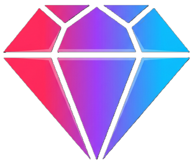

<div align="center">



# Ruby Smart Notes

**Your AI study partner that never sleeps** 🚀

[](https://nextjs.org/)
[](https://www.typescriptlang.org/)
[](https://neon.tech/)
[](https://ai.google.dev/)

*Drop in your lecture notes. Walk out with a summary, key concepts, a quiz, and an AI tutor that knows your material.*

</div>

---

## 🔥 What It Does

Tired of re-reading your notes for hours? **Ruby does the heavy lifting.**

- 📝 **Paste or upload** your notes (text, PDF, Word, PowerPoint, images, handwriting — anything)
- 🤖 **Gemini AI** reads them and instantly spits out:
  - A crisp **summary**
  - A list of **key concepts** with explanations
  - A **5-question quiz** to test yourself
- 💬 **Chat with your notes** — ask anything, and the AI answers using your material as context
- 🔐 Everything is **private to your account** — multi-tenant, locked tight

---

## ✨ Feature Highlights

| 🎯 Feature | 💡 What it means for you |
|---|---|
| **AI Summarization** | The most important ideas, distilled into one paragraph |
| **Key Concepts** | Auto-extracted terms with plain-English explanations |
| **Auto Quiz** | Test yourself immediately after every note you create |
| **AI Chat** | Like having a tutor who read your notes before you did |
| **Persistent Chat** | Conversations are saved — pick up exactly where you left off |
| **OCR & File Parsing** | Photos of handwritten notes? Uploaded PDFs? No problem |
| **Light + Dark Mode** | Your eyes will thank you |
| **100% Mobile Friendly** | Study from anywhere, on any device |

---

## 🛠️ Built With

<div align="center">

| Layer | Tech |
|---|---|
| Framework | Next.js 16 (App Router + Turbopack) |
| Language | TypeScript |
| Database | Neon Serverless Postgres |
| ORM | Drizzle ORM |
| Auth | Neon Auth (email + Google OAuth) |
| AI | Google Gemini 2.5 Flash |
| Office Files | officeparser |
| Animations | Framer Motion |
| Icons | Phosphor Icons |
| Styling | Vanilla CSS (glassmorphism) |

</div>

---

## 🚀 Run It Yourself

### You'll need

- Node.js 18+
- A [Neon](https://neon.tech/) account (free tier works great)
- A [Google AI Studio](https://aistudio.google.com/) API key

### 1. Clone & install

```bash
git clone https://github.com/your-username/ruby-smart-notes.git
cd ruby-smart-notes
npm install
```

### 2. Set your secrets

Create `.env.local` in the project root:

```env
# From your Neon project dashboard
DATABASE_URL="postgresql://..."

# From Google AI Studio
GEMINI_API_KEY="AIza..."

# From Neon Auth provisioning
NEON_AUTH_BASE_URL="https://<endpoint>.neonauth.<region>.aws.neon.tech/<db>/auth"
NEON_AUTH_COOKIE_SECRET="a-random-secret-at-least-32-chars-long"

# Your local dev URL
NEXT_PUBLIC_APP_URL="http://localhost:3000"
```

### 3. Push the schema

```bash
npx drizzle-kit push
```

### 4. Fire it up 🔥

```bash
npm run dev
```

Visit **[http://localhost:3000](http://localhost:3000)** and start studying smarter.

---

## 📁 Project Structure

```
src/
├── app/
│   ├── api/
│   │   ├── auth/[...path]/   → Neon Auth handler
│   │   ├── chat/             → AI chat + persistent history
│   │   ├── dashboard/        → User stats
│   │   ├── extract/          → OCR (Gemini Vision + officeparser)
│   │   ├── notes/            → Note CRUD
│   │   └── quizzes/          → Quiz scoring
│   ├── login/                → Auth page (email + Google)
│   ├── notes/
│   │   ├── new/              → Create a note
│   │   └── [id]/             → Note workspace (AI panel + chat)
│   ├── quizzes/[id]/         → Active quiz experience
│   └── page.tsx              → Dashboard
├── lib/
│   ├── auth.ts               → Server auth
│   ├── auth-client.ts        → Client auth
│   ├── authFetch.ts          → Auto-redirect on 401
│   ├── db.ts                 → Drizzle client
│   ├── schema.ts             → DB schema
│   └── ThemeProvider.tsx     → Light/dark mode
└── proxy.ts                  → Route protection middleware
```

---

## 📝 Supported File Types

| What you have | How Ruby reads it |
|---|---|
| `.txt` `.md` `.csv` `.json` | Reads directly in the browser — instant |
| `.png` `.jpg` `.jpeg` `.webp` | Gemini Vision extracts all visible text |
| `.pdf` | Gemini Vision reads every page |
| `.docx` `.pptx` `.xlsx` `.doc` | officeparser pulls the text content |
| 📸 Handwritten notes photo | Gemini Vision transcribes your handwriting |

---

## 🌐 Deploy to Production

1. Push to GitHub
2. Import into [Vercel](https://vercel.com/) (or any Next.js-compatible host)
3. Add your `.env.local` variables to your hosting provider's environment settings
4. Update `NEXT_PUBLIC_APP_URL` to your live domain

---

## 📄 License

[MIT](LICENSE) — free to use, modify, and build on.

---

<div align="center">

Made with ❤️ + 🤖 + ☕

**[⭐ Star this repo if it helped you study smarter!](https://github.com/your-username/ruby-smart-notes)**

</div>
