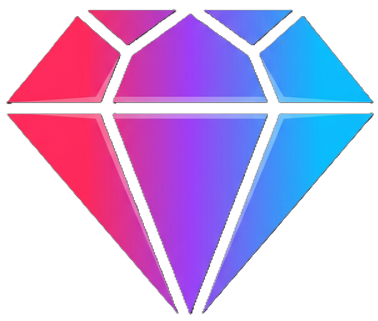

<div align="center">
  
</div>

# Ruby Smart Notes

Drop in your lecture notes — as text, a PDF, a slide deck, or a photo of your handwriting — and
get back a summary, the key concepts explained, a quiz to test yourself, and a tutor that has
read your material.

Built with Next.js 16, Neon Postgres, and Gemini 2.5 Flash.

---

## Why it takes photos

The hard part of a study tool isn't the summarising, it's the input. Real notes are rarely clean
text: they're a lecture PDF, a slide deck the lecturer shared, or a page of handwriting
photographed on a phone.

So extraction is its own route (`/api/extract`) with a path per input type:

| Input | Handled by |
|---|---|
| `.txt` `.md` `.csv` `.json` | Read directly, no model call |
| `.png` `.jpg` `.webp` `.pdf` | Gemini Vision reads the page, including handwriting |
| `.docx` `.pptx` `.xlsx` | `officeparser` pulls the text out |

Plain text skips the model entirely — no reason to spend a call on a file that's already
readable.

## What comes back

One pass over the extracted text produces three things, each stored separately so they can be
revisited without re-running the model:

- a **summary** on the note itself
- **key concepts**, each with a plain-English explanation
- a **five-question quiz** with options and the correct index

Then `/api/chat` answers questions with the note's content as context, and the conversation
persists — so you can close the tab and pick the thread back up.

## Data model

```
notes ─┬─ concepts        (cascade delete)
       ├─ quizzes ── questions
       └─ chat_messages
```

Everything hangs off `notes` with `onDelete: 'cascade'`, so deleting a note takes its concepts,
quizzes, questions, and chat history with it rather than leaving orphans.

## Multi-tenancy

Every route resolves the session first and returns `401` without one. Anything addressed by id
then re-checks ownership against the session user before touching it:

```ts
const note = await db.select()
  .from(notes)
  .where(and(eq(notes.id, noteId), eq(notes.userId, session.user.id)))
  .limit(1);

if (note.length === 0) {
  return NextResponse.json({ error: 'Forbidden' }, { status: 403 });
}
```

Knowing a note's UUID isn't enough to read or chat with it — the row has to belong to you.

## Stack

| Layer | Choice |
|---|---|
| Framework | Next.js 16, App Router, Turbopack |
| Language | TypeScript |
| Database | Neon serverless Postgres |
| ORM | Drizzle |
| Auth | Neon Auth — email and Google OAuth |
| Model | Gemini 2.5 Flash, including Vision for OCR |
| Office files | officeparser |
| UI | Vanilla CSS, Framer Motion, Phosphor Icons |

---

## Running it

Needs Node 18+, a [Neon](https://neon.tech/) project, and a
[Google AI Studio](https://aistudio.google.com/) key.

```bash
npm install
```

Create `.env.local`:

```env
DATABASE_URL="postgresql://..."                # Neon dashboard
GEMINI_API_KEY="AIza..."                       # Google AI Studio
NEON_AUTH_BASE_URL="https://<endpoint>.neonauth.<region>.aws.neon.tech/<db>/auth"
NEON_AUTH_COOKIE_SECRET="at-least-32-random-characters"
NEXT_PUBLIC_APP_URL="http://localhost:3000"
```

Push the schema and start:

```bash
npx drizzle-kit push
npm run dev
```

## Layout

```
src/app/api/
  auth/[...path]/   Neon Auth handler
  extract/          OCR and file parsing
  notes/            note CRUD, and the summary/concepts/quiz generation
  chat/             chat over a note, with history
  quizzes/score/    scoring
  dashboard/        user stats
src/app/
  notes/[id]/       note workspace — AI panel and chat
  quizzes/[id]/     the quiz run
src/lib/
  schema.ts         Drizzle schema
  auth.ts           server-side session
  authFetch.ts      client fetch that redirects on 401
src/proxy.ts        route protection
```

## Deploying

Import into Vercel, set the same environment variables, and point `NEXT_PUBLIC_APP_URL` at the
live domain.

## License

MIT.
